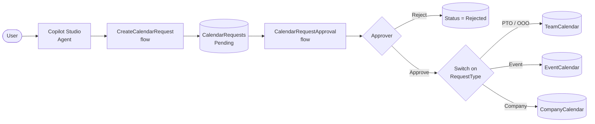

# Calendar Request Approval Lab

A reference implementation showing how to build a **conversational calendar booking system** in Microsoft 365 using:

- **SharePoint Lists** as the data store
- **Power Automate** for workflow + approvals
- **Copilot Studio** for the natural-language agent

End users chat with a Copilot Studio agent ("Book me PTO next Friday", "Add a company all-hands on June 10") and the request flows through an approver before landing on the right calendar list.

## Architecture



See [docs/flow.md](docs/flow.md) for the full sequence diagram and decision flow.

## Components

| Layer            | Artifact                          | Purpose                                       |
| ---------------- | --------------------------------- | --------------------------------------------- |
| Data             | `CalendarRequests` list           | Inbox for all incoming requests               |
| Data             | `TeamCalendar` list               | Approved team / personal events (PTO, OOO)    |
| Data             | `EventCalendar` list              | Approved project / event entries              |
| Data             | `CompanyCalendar` list            | Approved org-wide events                      |
| Workflow         | `CreateCalendarRequest` flow      | Instant flow called by the agent              |
| Workflow         | `CalendarRequestApproval` flow    | Approval routing + dispatch to target list    |
| Conversational   | `Calendar Management Agent`       | Copilot Studio agent (natural language entry) |

## Repo layout

```
docs/         architecture, setup, troubleshooting
sharepoint/   list schemas (columns, types)
flows/        Power Automate flow definitions (logic only)
agent/        Copilot Studio agent topics & instructions
```

## Get started

See [docs/setup.md](docs/setup.md) for end-to-end provisioning.

## License

MIT — see [LICENSE](LICENSE).

> This is a sanitized reference implementation. All tenant IDs, user accounts, environment IDs, and screenshots from the original build have been removed.
