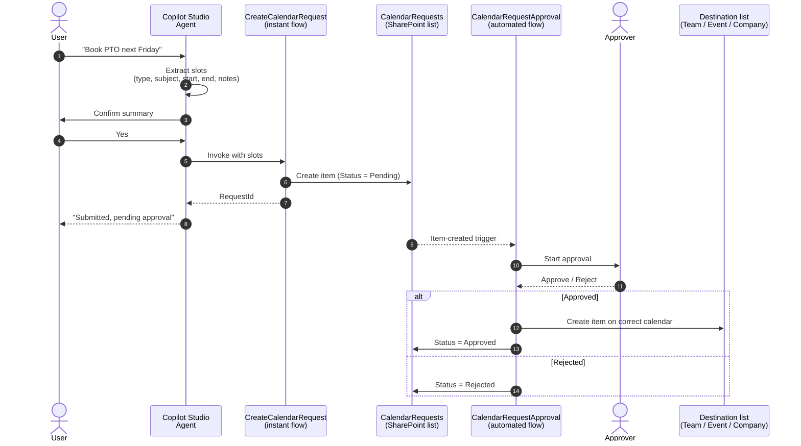
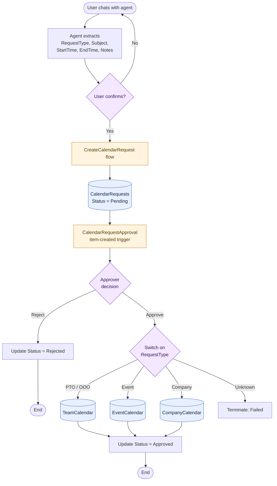

# Flow Diagram

End-to-end request lifecycle. GitHub renders Mermaid natively.

## High-level sequence

```mermaid
sequenceDiagram
    autonumber
    actor U as User
    participant A as Copilot Studio<br/>Agent
    participant F1 as CreateCalendarRequest<br/>(instant flow)
    participant L as CalendarRequests<br/>(SharePoint list)
    participant F2 as CalendarRequestApproval<br/>(automated flow)
    actor AP as Approver
    participant D as Destination list<br/>(Team / Event / Company)

    U->>A: "Book PTO next Friday"
    A->>A: Extract slots<br/>(type, subject, start, end, notes)
    A->>U: Confirm summary
    U->>A: Yes
    A->>F1: Invoke with slots
    F1->>L: Create item (Status = Pending)
    F1-->>A: RequestId
    A-->>U: "Submitted, pending approval"
    L-->>F2: Item-created trigger
    F2->>AP: Start approval
    AP-->>F2: Approve / Reject
    alt Approved
        F2->>D: Create item on correct calendar
        F2->>L: Status = Approved
    else Rejected
        F2->>L: Status = Rejected
    end
```

## State / decision flow

```mermaid
flowchart TD
    Start([User chats with agent]) --> Extract[Agent extracts<br/>RequestType, Subject,<br/>StartTime, EndTime, Notes]
    Extract --> Confirm{User confirms?}
    Confirm -- No --> Start
    Confirm -- Yes --> CreateFlow[CreateCalendarRequest flow]
    CreateFlow --> Inbox[(CalendarRequests<br/>Status = Pending)]
    Inbox --> Trigger[CalendarRequestApproval<br/>item-created trigger]
    Trigger --> Approval{Approver<br/>decision}
    Approval -- Reject --> Reject[Update Status = Rejected]
    Reject --> EndR([End])
    Approval -- Approve --> Switch{Switch on<br/>RequestType}
    Switch -- PTO / OOO --> Team[(TeamCalendar)]
    Switch -- Event --> Event[(EventCalendar)]
    Switch -- Company --> Company[(CompanyCalendar)]
    Switch -- Unknown --> Fail[Terminate: Failed]
    Team --> Approved[Update Status = Approved]
    Event --> Approved
    Company --> Approved
    Approved --> EndA([End])

    classDef store fill:#e8f0ff,stroke:#3b6fb6,color:#0b2545;
    classDef flow fill:#fff4e0,stroke:#c97e10,color:#5a3a00;
    classDef decision fill:#f3e8ff,stroke:#7e3fc8,color:#3b125f;
    class Inbox,Team,Event,Company store;
    class CreateFlow,Trigger flow;
    class Confirm,Approval,Switch decision;
```
