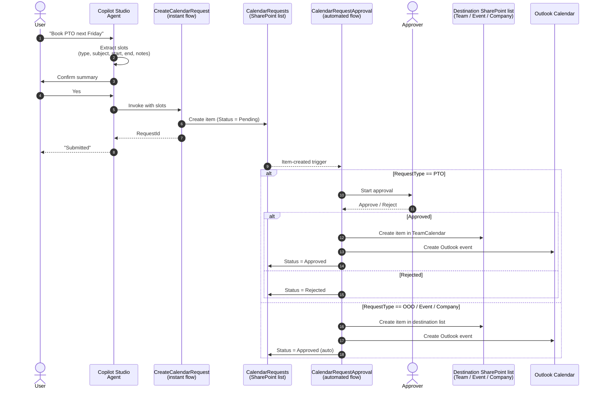
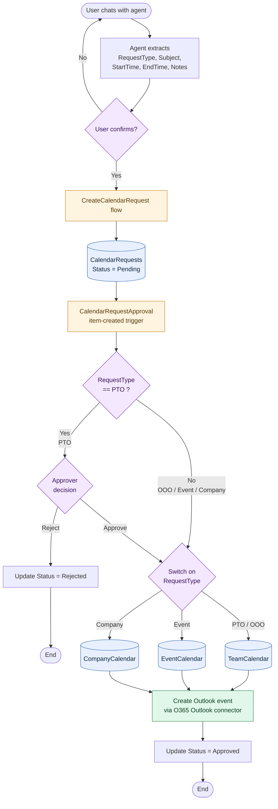

# Flow Diagram

End-to-end request lifecycle. GitHub renders Mermaid natively.

## Key behaviors

- **Only `PTO` requires approval.** All other request types (`OOO`, `Event`, `Company`) are written directly to their destination calendar.
- **Every approved request produces two artifacts:** a row in the appropriate **SharePoint calendar list** AND a corresponding **Outlook calendar event** (created via the Office 365 Outlook connector).

## High-level sequence

## State / decision flow

